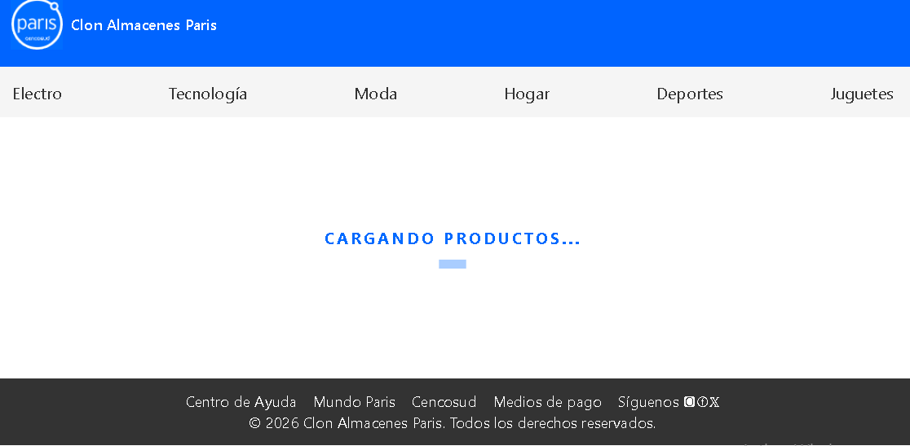
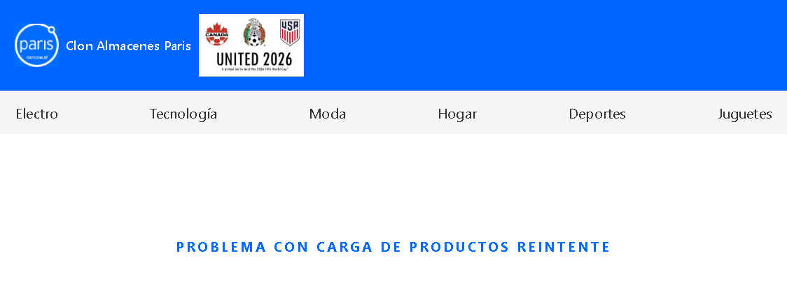
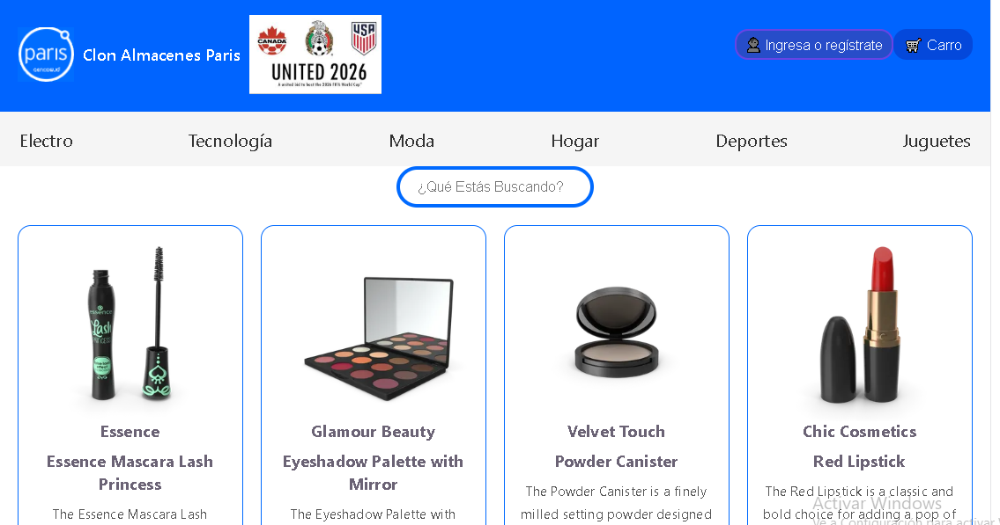
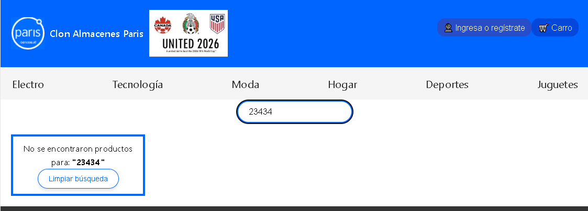

## IPSS-evaluacion-modulos-2
Fase 1 : Clon-e-commerce-Paris-Mundial , desarrollado con HTML5, CSS , JavaScript y JavaScript Syntax Extension. React, node.js y Npm.
Fase 2 : Se modifica uso de Json por uso de API Publica para obtener productos. Se incorporara SearchBar

## Nombre del grupo
EVALUACION 2 DIPLOMADOS IPSS

## Integrantes
Sergio Casapia Churata

## Descripción
Fase 1 Completada : Sitio desarrollado como clon visual ecommerce Paris. El objetivo es replicar el ecommerce usando los conocimientos de las clases y material complementario.
Fase 2 : Desarrollo

## Demo
Sitio desplegado: https://sergiocasapia.github.io/e-commerceClonParisMundial/

## Capturas de pantallas del resultado final
Fase 1 :
Header

NavBar

Cardlist

Footer

Fase 2 :
markdown

## Cómo correr localmente
Ejecutar : cdm
ir a ruta : my-clone-paris-mundial
Ejecutar : git clone https://github.com/sergiocasapia/e-commerceClonParisMundial
Ejecutar : npm run dev
Acceder : http://localhost:5173/
Ejecutar acceso a vsc : code .

## Tecnologias usadas
Fase 1 :
Framework React
Node.js Entorno Js
NPM Gestor de Paquetes de Node
Render
Props
Componentes
operadores ternarios anidados
Archivos json de datos
reutilizacion de Componentes
Fase 2 :
Consumo de API Publica para obtener productos
incorporacion de SearchBar
Logica de Carga, Errores o No hay producto

## Componentes Creados (listas)
Fase 1:
(*) : Cabe indicar que ninguno de lo botones, tiene aun fucionalidad asociadas, ya que quedara para completar en fase 2.
/src/components/HeaderComponent/Header.jsx --> Se utiliza 2 veces el componente Button.jsx para registrarse o carro (*)
/src/components/NavBarComponent/NavBar.jsx --> utiliza el mock NavBarCategorias.js para desplegar menu de categorias (*)
/src/components/ProductListComponent/ProductList.jsx --> utiliza el mock articulos.js de productos con el funcion map para recorrer el objeto articulo invocando el componente ProductCard.jsx.
/src/components/ProductCardComponent/ProductCard.jsx --> este componente revise como props el objeto articulo y despligar la informacion con su imagen y opcional despacho gratis, donde cuyo objeto atributo isSuperDespach=true. Adicional se utiliza el componente Button para agregar al carro.(*)
/src/components/FooterComponent/Footer.jsx --> utiliza el componente Button.jsx y mock enlacesfooter.js para desplegar menu de opciones complementarias (*) 
/src/components/ButtonComponent/Button.jsx --> utiliza operacion ternaria anidada para soporte uso de componentes Header.jsx y Footer.jsx
Fase 2 :
Esta comprende el uso de API de productos, desplegarlos en formato, validando errores, carga o existencia, informando al usuario en cada evento.
/src/components/SearchBarComponent/SearchBar.jsx --> Se incorpora para la busqueda de productos
/src/components/ProductListComponent/ProductList.jsx --> Se modifica incorporando el uso de APÏ de productos. Uso de Hooks useEffect y useState, para manejar la carga y cambio de estados. La logica del control de carga y errores. 
Traspado a Componente Card, la lista completa o filtrada (Con despliegue exitoso o mensaje no encontro producto, que que reutiliza componente Button)
Se cambia a uso de estilo module.css
/src/components/ProductCardComponent/ProductCard.jsx --> Se incorpora promocion de delivery gratis si precio de producto es mayor a 200.00, con mensaje destacado.
Se reutiliza componente Button, para simular agregar al carro.
Se cambia a uso de estilo module.css
